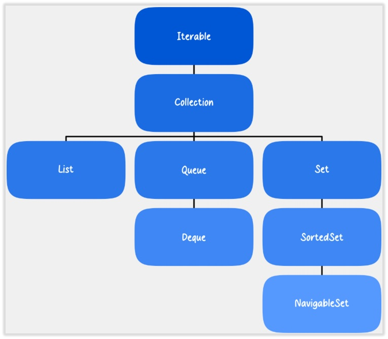

# C++ Advanced Projects

Welcome to my personal C++ projects portfolio, built and organized on Ubuntu using the GCC compiler.  
This repository serves as a central hub for various projects that explore advanced features of C++, demonstrating practical implementations of powerful techniques and concepts.

Each subdirectory in this repository contains a standalone project — from templates and STL mastery to complex input/output handling.  
These projects are structured to reflect not only my learning journey but also my practical skills in modern C++ development.

---

# Introduction to the STL

The **Standard Template Library (STL)** is a fundamental part of the C++ programming environment. If you're planning to work with C++, learning how to use the STL is not optional — it’s essential.

## What is STL?

The STL is a collection of **generic, reusable, and efficient** software components. It offers well-tested solutions to many common programming problems, saving time and effort for developers.

The term "Standard" implies that the STL is included with every modern C++ compiler, which greatly enhances **code portability** across different platforms and systems.

## Why use the STL?

- Eliminates the need to reinvent common data structures or algorithms  
- Ensures high performance through optimized implementations  
- Enables clean, maintainable, and expressive code  
- Improves portability by relying on standard components

## What problems can STL solve?

While the STL is incredibly versatile, it's not a complete solution for every scenario. That's why additional libraries like **Boost** exist, along with ongoing improvements to the C++ language. Still, the STL covers a wide range of use cases, particularly in:

- **Data storage and access** (via containers)  
- **Data manipulation and processing** (via algorithms)

## STL Core Components

The STL is generally divided into two main parts:

- **Containers**:  
  Provide various ways to store collections of data (e.g., `vector`, `map`, `set`, `deque`, etc.)

- **Algorithms**:  
  Provide a rich set of operations that can be performed on containers, such as `sort`, `find`, `copy`, `accumulate`, and many more.

> 🧠 STL promotes writing generic and reusable code, following the principles of generic programming.




---

## 🔧 Core Competencies Demonstrated

### 🧩 Templates
- Usage of function and class templates.
- Generic programming practices.
- Type-independent code design.

### 📚 Standard Template Library (STL)
- **Sequential Containers**: `vector`, `deque`, `list`
- **Associative Containers**: `set`, `map`, `multiset`, `multimap`
- **Container Adapters**: `stack`, `queue`, `priority_queue`

### ⚙️ STL Algorithms
- Non-modifying algorithms: `for_each`, `find`
- Modifying algorithms: `transform`, `copy`, `swap`
- Sorting and merging: `sort`, `stable_sort`, `merge`, `inplace_merge`

### 🔁 Iterators and Utilities
- Custom iterators and iterator traits.
- STL functors and utility functions.

### 💾 Advanced I/O Handling
- Console and file I/O operations.
- Stream formatting and string streams.

---
## STL

### 📘 Module 1  
[](https://github.com/alfecjo/Cplus_plus_Advanced/tree/main/archives/module1)

---

📌 **Note:** This project is evolving. More modules, examples, and advanced C++ features will be continuously added.


## 🐧 Environment

All projects are developed and tested using:
- **OS**: Ubuntu Linux
- **Compiler**: `g++` (GCC)
- **Build Tool**: Makefiles or raw g++ commands
- **Version Control**: Git

---

## 📂 Repository Structure

```
Cplus_plus_Advanced/templates/
├── module1/
│   └── simple-array/
│   │   ├── src/
│   │   │   └── Array.cpp
│   │   │   └── main.cpp
│   │   └── include/
│   │   │   └── Array.hpp
│   │   └── CMakeLists.txt
│   │   └── README.md
│   │   
│   └── vector-array/
│   │   ├── src/
│   │   │   └── ArrayVector.cpp
│   │   │   └── main.cpp
│   │   └── include/
│   │   │   └── ArrayVector.hpp
│   │   └── CMakeLists.txt
│   │   └── README.md
│   .
│   .
│   .
│
└── README.md (this file)

```

Each folder includes:
- Source code files (`.cpp`)
- Headers (`.h`/`.hpp`)
- Compilation instructions
- Sample output or test data where applicable

---

## 🎯 Purpose

This repository not only supports my preparation for CPP certification but also serves as a showcase of applied C++ knowledge.  
It reflects my ability to build modular, efficient, and idiomatic C++ applications from scratch in a Linux environment.

Feel free to explore, clone, and adapt the projects as needed. Contributions and feedback are welcome!

---

## 👤 Author
**[Antonio Almeida](https://alfecjo.github.io/)**

**Platform:** Ubuntu + GCC  
**Language:** C++17/C++20  

---

- ## Return
  [](https://github.com/alfecjo)
