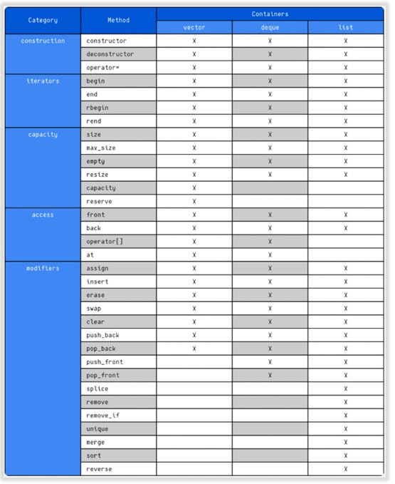

# Sequence Containers in C++

## 🧾 Overview

**Sequence containers** are fundamental components of the C++ Standard Template Library (STL). They store collections of elements in a **linear arrangement**, where the **position of each element** is **explicitly controlled by the programmer**.

Unlike associative containers, sequence containers do **not associate elements with keys**, and the container **does not influence** the order — insertion, removal, and manipulation are performed at positions specified by the programmer.

---

## 📦 Types of Sequence Containers

The STL provides the following sequence containers:

### 1. `vector`
- A dynamic array that supports **fast random access**.
- Memory is contiguous.
- **Efficient insertion/removal at the end**, but **expensive at the front or middle**.

### 2. `deque` (Double-Ended Queue)
- Supports **fast insertion/removal at both ends**.
- Memory may not be contiguous.
- Useful when frequent insertions/removals occur at both the front and back.

### 3. `list` (Doubly Linked List)
- Allows **constant-time insertion and removal** from anywhere in the list.
- No random access — elements must be traversed sequentially.
- Efficient when frequent insertions/deletions occur at arbitrary positions.

---

## ⚙️ Key Characteristics

- Elements are ordered by position (not by key).
- Access can be positional (e.g., via iterators or indices).
- They are suitable for stacks, queues, dynamic arrays, etc.
- Memory and performance characteristics vary between types.

---



---

## ✅ When to Use

| Container | Best For                                      |
|-----------|-----------------------------------------------|
| `vector`  | Random access and appending data              |
| `deque`   | Queues, stacks, both ends usage               |
| `list`    | Insertions/removals in the middle or front    |

---

## 🛠️ Build Instructions

If your repository includes buildable source files:
```bash
g++ -std=c++17 -o my_program main.cpp
./my_program

```
---

> ⚠️ Choose the container based on your performance and memory needs. Not all sequence containers are equal in complexity and speed.

---

## 👤 Author
**[Antonio Almeida](https://alfecjo.github.io/)**

**Platform:** Ubuntu + GCC  
**Language:** C++17/C++20  

---

- ## Return to the main page
  [](https://github.com/alfecjo/Cplus_plus_Advanced/tree/main/archives/module1)

