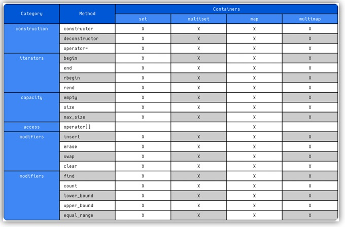
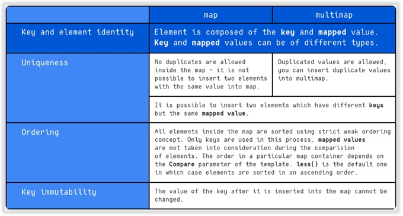

# Associative Containers in C++

## 🧾 Overview

**Associative containers** are a category of containers in the C++ Standard Template Library (STL) where each element is associated with a *key*. This key allows for fast retrieval and management of data, as opposed to **sequence containers** (like `vector` or `list`), where elements are accessed by position (index).

Associative containers are typically implemented using **binary search trees** (such as red-black trees), offering logarithmic time complexity for common operations like insertion, deletion, and search.

---

## 📦 Types of Associative Containers

The STL provides four main types of associative containers:

- [`std::set`](https://en.cppreference.com/w/cpp/container/set): Stores unique keys in a sorted order.
- [`std::multiset`](https://en.cppreference.com/w/cpp/container/multiset): Stores duplicate keys in a sorted order.
- [`std::map`](https://en.cppreference.com/w/cpp/container/map): Stores key–value pairs with unique keys, sorted by key.
- [`std::multimap`](https://en.cppreference.com/w/cpp/container/multimap): Stores key–value pairs with duplicate keys, sorted by key.

> 🔎 Note: Although `std::bitset` is technically an associative container, it is specialized for handling bits and is not covered here.

---

## ⚙️ Characteristics

- Fast search, insertion, and deletion (`O(log n)` complexity).
- Ordered traversal (elements are sorted by key).
- Larger memory footprint compared to sequence containers.
- Ideal for use cases where key-based access is frequent or required.

---





---

## ✅ Example Use Cases

- Implementing dictionaries or lookup tables (`map`/`multimap`)
- Counting frequencies of elements (`map`)
- Maintaining sorted collections without duplicates (`set`)
- Grouping duplicates while maintaining order (`multiset`)

---

### 📘 STL Associative Containers - mixed examples
[](https://github.com/alfecjo/Cplus_plus_Advanced/tree/main/archives/module/002_STL-AssociativeContainers/mixed)

---

## 📚 Further Reading

- [C++ Reference - Associative Containers](https://en.cppreference.com/w/cpp/container)
- [GeeksforGeeks: Associative Containers in STL](https://www.geeksforgeeks.org/associative-containers-the-c-standard-template-library-stl/)

---

## 🛠️ Build Instructions

If your repository includes buildable source files:
```bash
g++ -std=c++17 -o my_program main.cpp
./my_program

```
---

## 👤 Author
**[Antonio Almeida](https://alfecjo.github.io/)**

**Platform:** Ubuntu + GCC  
**Language:** C++17/C++20  

---

- ## Return to the main page
  [](https://github.com/alfecjo/Cplus_plus_Advanced/tree/main/archives/module)
