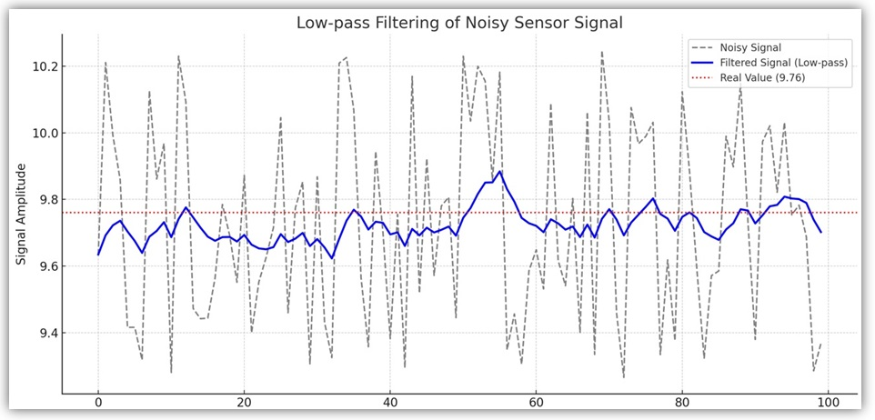

# Signal Filtering Example Using C++ Algorithms

## Example t027.cpp

This project demonstrates the use of **modifying algorithms** from the C++ Standard Library in the context of **signal filtering** — specifically, applying a **low-pass filter** to noisy sensor data. This is particularly relevant in fields like engineering, instrumentation, and embedded systems, where signals acquired from sensors often contain noise due to environmental or electrical interference.

 

## 🧪 Scenario

Imagine we are measuring a **physical quantity** such as:

- Temperature of a pipe
- Voltage from an analog sensor
- Electrical current in a motor

The real value is assumed to be **9.76** (in appropriate units), but the signal received from the sensor is noisy due to fluctuations and transient interference. 

## 🧰 Implementation

We simulate the noisy signal using a random generator and apply a **low-pass filter** to smooth the data. The filtering technique used here is a **moving exponential average**, which is simple yet effective for real-time systems.

```cpp
filtered = alpha * new_sample + (1 - alpha) * previous_filtered;
---

## 🛠️ Build Instructions

If your repository includes buildable source files:
```bash
g++ -std=c++17 -o my_program main.cpp
./my_program

```

---

## 👤 Author
**[Antonio Almeida](https://alfecjo.github.io/)**

**Platform:** Ubuntu + GCC  
**Language:** C++17/C++20  

---

- ## Return to the main page
  [](https://github.com/alfecjo/Cplus_plus_Advanced/tree/main/archives/module/004_STL-AlgorithmsModifying)


