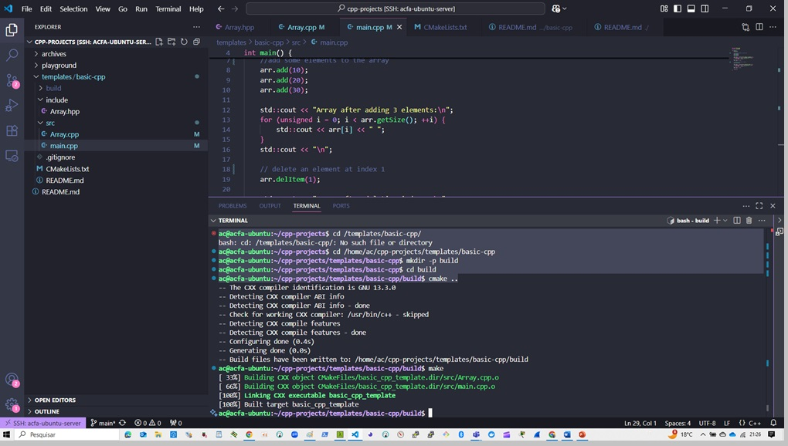

# Dynamic Integer Array (C++)

## Purpose

This project implements a simple dynamic integer array in C++ to demonstrate low-level memory management without relying on STL containers like `std::vector`.

## Cause

In many educational and embedded systems contexts, understanding how arrays grow, shrink, and are managed manually is essential. This project showcases how to:

- Dynamically allocate and deallocate memory using `new` and `delete`
- Implement a custom `add()` and `delItem()` method
- Handle out-of-bounds access with exception safety
- Overload the subscript `[]` operator

## Effect

This implementation allows:

- Appending elements to a dynamic array
- Removing elements by index
- Safe access to elements with bounds checking
- Understanding the implications of manual memory handling

## Techniques & References

The concepts shown here are commonly found in:

- **Books**:  
  - *The C++ Programming Language* – Bjarne Stroustrup  
  - *Accelerated C++* – Koenig & Moo

- **Courses**:  
  - CS106B – Stanford University  
  - CS50 – Harvard University (Pointers & memory section)

- **Online Resources**:  
  - [cplusplus.com – Dynamic Memory](https://cplusplus.com/doc/tutorial/dynamic/)  
  - [cppreference.com – new/delete](https://en.cppreference.com/w/cpp/language/new)

---



---

## How to Build

```bash
g++ -o array main.cpp Array.cpp
./array

```
---

## 👤 Author
**[Antonio Almeida](https://alfecjo.github.io/)**

**Platform:** Ubuntu + GCC  
**Language:** C++17/C++20  

---

- ## Return to the main page
  [](https://github.com/alfecjo/Cplus_plus_Advanced/tree/main)
